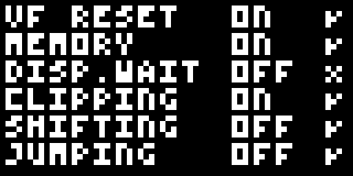

# chip8-go

A Golang CHIP-8 emulator.

## Test results

Automated screenshots from test runs done with [GitHub actions](./.github/workflows/golang-integration.yaml).

### Timendus

[CHIP-8 test suite](https://github.com/Timendus/chip8-test-suite)

|                CHIP-8 logo                |               IBM logo                |              Corax+               |
|:-----------------------------------------:|:-------------------------------------:|:---------------------------------:|
|  |  |  |

|              Flags              |              Quirks               |
|:-------------------------------:|:---------------------------------:|
|  |  |
