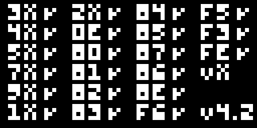
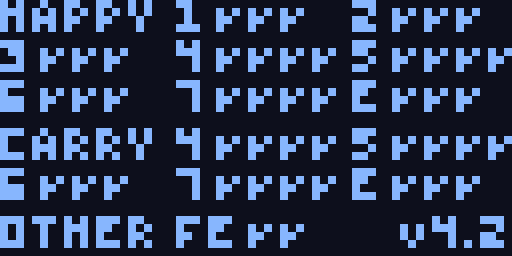
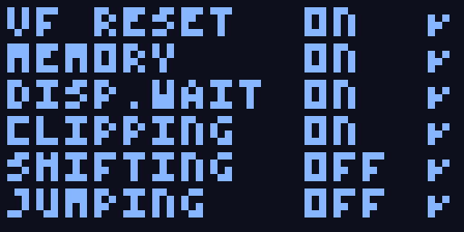
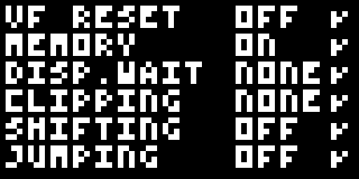
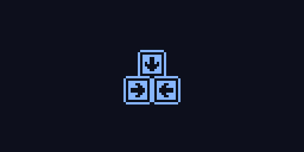
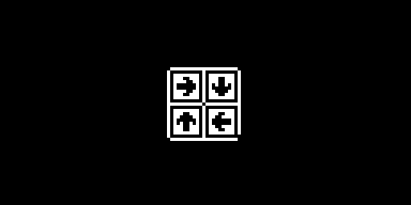

# chip8-go

A Golang CHIP-8 interpreter.

## Test results

Automated screenshots from test runs done with [GitHub actions](./.github/workflows/golang-integration.yaml).

### Timendus

[CHIP-8 test suite](https://github.com/Timendus/chip8-test-suite)

|                CHIP-8 logo                |               IBM logo                |              Corax+               |              Flags              |
|:-----------------------------------------:|:-------------------------------------:|:---------------------------------:|:-------------------------------:|
|  |  |  |  |

|                Quirks (CHIP-8)                |              Quirks (SUPER-CHIP)              |            Quirks (XO-CHIP)             |
|:---------------------------------------------:|:---------------------------------------------:|:---------------------------------------:|
|  |  |  |

|               Scrolling SUPER-CHIP low resolution               |              Scrolling SUPER-CHIP high resolution               |             Scrolling XO-CHIP low resolution              |             Scrolling XO-CHIP high resolution             |
|:---------------------------------------------------------------:|:---------------------------------------------------------------:|:---------------------------------------------------------:|:---------------------------------------------------------:|
|  |  |  |  |

## Improvement ideas

- [x] Embed SDL3
- [x] Implement SUPER-CHIP
- [ ] Implement XO-CHIP
- [ ] Adjust speed dynamically
- [ ] Change window title when game paused
- [ ] Load rom with drag-n-drop if not provided
- [ ] Create Nix package
